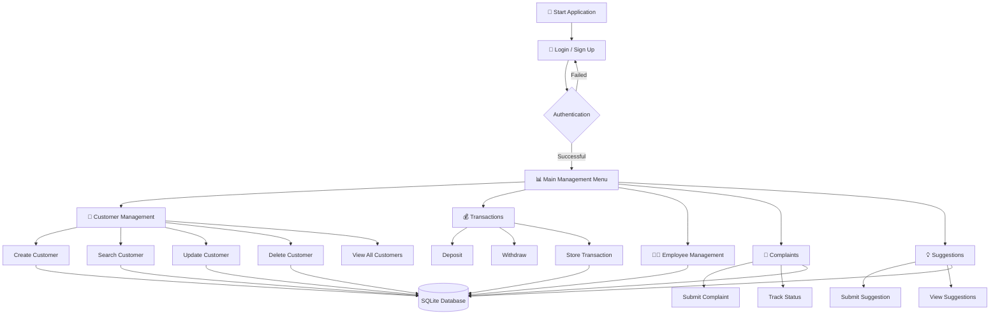
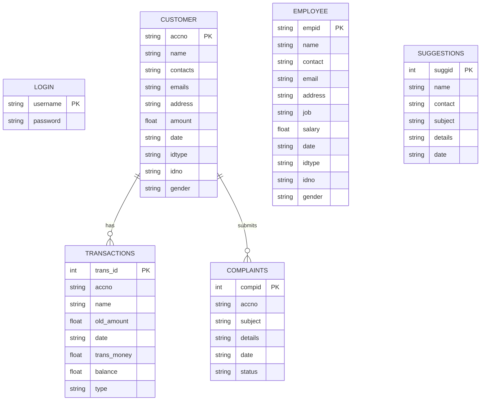

# 🏦 Bank Management System

> A desktop-based banking management application built with **Python, Tkinter and SQLite**, designed to practice GUI development, database operations, authentication, CRUD functionality and transaction management.


---

## 📌 About the Project

**Bank Management System** is a desktop application developed as a Python practice project to explore how a real-world management system can combine a graphical interface with persistent database storage.

The application provides an administrator-oriented interface for managing:

* 👤 Customer accounts
* 💰 Deposits and withdrawals
* 🧾 Transaction records
* 👨‍💼 Employee information
* 📋 Customer complaints
* 💡 Suggestions and feedback
* 🔐 User authentication

The project uses **Tkinter** for the interface and **SQLite** for local database management, keeping the entire application lightweight and dependency-free.

---

## ✨ Key Features

### 🔐 Authentication

* User registration
* Login validation
* SQLite-backed credentials
* Login success/failure handling

### 👤 Customer Management

* Automatically generated 8-digit account numbers
* Add new customers
* Search customer records
* Update customer information
* Delete customer records
* View all customer accounts

### 💸 Banking Transactions

* Deposit money
* Withdraw money
* Balance validation
* Automatic balance calculation
* Transaction history storage
* Transaction date and type tracking

### 👨‍💼 Employee Management

* Add employee records
* Search employees
* Update employee information
* Delete employee records
* Store job and salary information

### 📢 Complaint Management

* Submit customer complaints
* View complaint records
* Track complaint status
* Status options:

  * `Pending`
  * `In Progress`
  * `Resolved`

### 💡 Suggestion Management

* Submit suggestions
* Store contact information
* View suggestion history
* Timestamp suggestion records

---

## 🔄 Application Workflow



---

## 🗄️ Database Design

The application uses a local **SQLite database** that is automatically created when the application starts.

### Main Tables

| Table          | Purpose                                          |
| -------------- | ------------------------------------------------ |
| `login`        | Stores registered usernames and passwords        |
| `customer`     | Stores customer account and personal information |
| `transactions` | Stores deposit and withdrawal records            |
| `employee`     | Stores employee information                      |
| `complaints`   | Stores customer complaints and their status      |
| `suggestions`  | Stores suggestions and feedback                  |

### Database Flow



---

## 🛠️ Tech Stack

| Technology          | Usage                                         |
| ------------------- | --------------------------------------------- |
| 🐍 **Python 3**     | Application logic                             |
| 🖥️ **Tkinter**     | Desktop GUI                                   |
| 🗄️ **SQLite3**     | Local database                                |
| 🧩 **OOP**          | Database management through `DatabaseManager` |
| 📊 **ttk.Treeview** | Tabular record display                        |

### Python Modules Used

```text
tkinter
sqlite3
random
time
datetime
```

All of these are part of Python's standard library, so **no third-party Python packages are required**.

---

## 📂 Project Structure

```text
Bank-Management-System/
│
├── bank_management_system.py    # Main application
├── requirements.txt              # Dependency information
├── README.md                     # Project documentation
└── mybankingdb.db                # Generated SQLite database
```

> `mybankingdb.db` is created automatically when the application runs for the first time.

---

## 🚀 Getting Started

### 1. Clone the Repository

```bash
git clone https://github.com/taniiishaa/Bank-Management-System.git
cd Bank-Management-System
```

### 2. Run the Application

Since the project only uses Python's standard library, no external package installation is required.

```bash
python bank_management_system.py
```

The application will automatically initialize the SQLite database and required tables.

---

## 🖥️ Using the Application

### Step 1 — Authentication

Create an account using the sign-up option and log in using the registered credentials.

### Step 2 — Main Menu

After successful authentication, the main management interface provides access to the different modules.

### Step 3 — Manage Customers

Create and manage customer accounts, including their contact information, identification details and account balance.

### Step 4 — Perform Transactions

Search for a customer account and perform:

```text
Deposit → Update Balance → Store Transaction
```

or

```text
Withdraw → Validate Balance → Update Balance → Store Transaction
```

### Step 5 — Manage Employees

Add, search, update and remove employee records.

### Step 6 — Handle Feedback

Administrators can manage customer complaints and track their status, while suggestions can be submitted and reviewed through the suggestion log.

---

## 🧠 Concepts Practiced

This project helped strengthen several core software-development concepts:

* Python fundamentals
* Object-oriented programming
* GUI development
* Event-driven programming
* SQLite database integration
* SQL CRUD operations
* Form validation
* Authentication logic
* Exception handling
* Data persistence
* Modular application design
* Working with `Treeview`
* Managing multiple GUI frames

---

## 📚 What I Learned

Building this project helped me understand how individual Python concepts come together to form a complete desktop application.

Some of the key areas I practiced were:

> **Python → GUI → Database → CRUD → Validation → Application Workflow**

It was particularly useful for understanding how a Python application can interact with a relational database and maintain persistent information across different parts of the application.

---

## 🔮 Future Improvements

Possible improvements for a more production-oriented version include:

* 🔒 Password hashing instead of storing plain-text passwords
* 👥 Separate administrator and customer roles
* 🧾 Detailed transaction-history interface
* 📊 Banking analytics dashboard
* 🔍 Advanced search and filtering
* 🧪 Automated testing
* 📝 Better input validation
* 🗃️ Foreign-key relationships between database tables
* 🎨 Modernized GUI design
* 🌐 Migration from desktop GUI to a web-based architecture

---

## 🎯 Project Context

This project is part of my **Python Foundations** work, where I explored how programming fundamentals can be applied to practical management-system applications.

It represents an early step in my journey from learning Python fundamentals to building larger applications involving **backend development, databases, APIs, AI and cloud technologies**.

---

⭐ If you found this project useful, feel free to explore the repository and check out my other projects.
